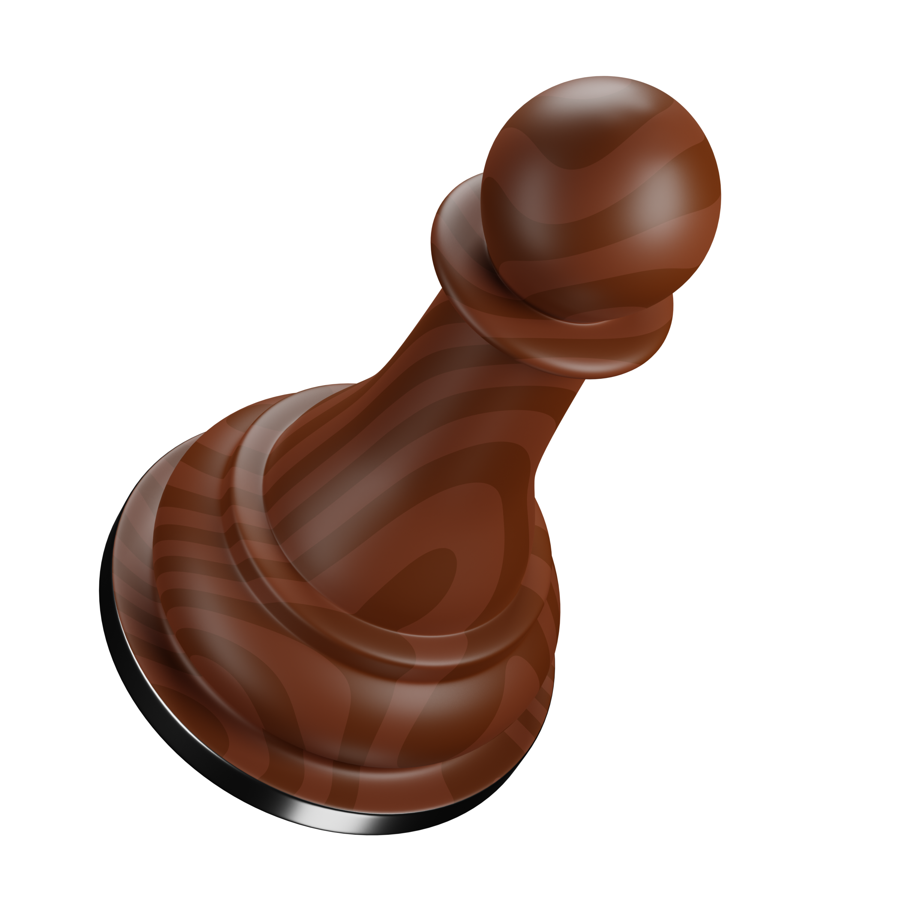

#  Eureka: A Multi-Agent Neurosymbolic System for Chess


## Motivation
Eureka is an approach that provides reasoning and understanding of the chess move. It transmits information represented in the knowledge base in Prolog to nodes and edges as a knowledge graph in Neo4j that can be queried directly to retrieve structured information from the knowledge graph. This information advocates the reasoning behind the suggested move. This allows to build dynamic ontologies as a solution where static ontologies would fail, since small variances between chessboards can have an enormous difference in the information represented in the ontology. By leveraging the capabilities of combining both a large model called Gemini and the existing knowledge in Neo4j using LangChain, Eureka is capable of creating chess commentary based on user input related to piece positions and relations between pieces on a chessboard and providing a move commentary. Eureka also utilizes a newly introduced library called LangGraph to implement a verification module that acts as a guard to prevent any incorrectly generated commentary where the results obtained from the system almost contain no hallucinations. This prototype can be scaled to be a software solution that assists in teaching beginners chess rules and tactics, where existing solutions either provide a basic explanation or statistical representation that does not help a beginner understand the reason behind a chess move.

## Video
<video width="320" height="240" autoplay>
  <source src="videos/eureka.mp4" type="video/mp4">
Your browser does not support the video tag.
</video>

## Architecture
### Eureka's Architecture
As an approach for creating a system capable of generating chess commentary and diminishes the amount of hallucination. Eureka grounds Gemini LLM, which is Gemini with the built knowledge graphs in Neo4j, which result in the construction of a Retrieval Augmented Generation (RAG) system that enhances the outcome of large language model (LLM) based on the facts stored in the knowledge graph in Neo4j.

Eureka utilizes LangChain that allow to create agents from Large Language Models such as Gemini and specify the purpose of each agent using Prompt Engineering by specifying its role and context and giving it examples of how to perform its task. The process of providing chess commentary is the following:
1. User clicks on the toggle button to use Gemini and sends a request from the browser using Next.js with a query in natural language.
2. The request is handled at the backend using APIs in Flask, which contains an instance of the chess commentary agent.
3. The agent is configured with tools that allow it to use other agents by forming chains for a specific type of question, such as for questions that are related to chess pieces position and moves, it would use GraphCypherQAChain from LangChain to generate a Cypher query that can be executed and retrieve a structured response that is sent to the main agent to transform it back to natural language, or if the query is about tactics, it would use the basic neurosymbolic module and summarise its answer.
4. In both cases, the retrieved answer, either from sub-agent or from the neurosymbolic module, is sent back to the user in the body of the response to the request made in the browser.


### Example
Let’s call the first agent “the conductor” which is a person who directs the performance of an orchestra as it orchestrate what module to use based on the user question and what information to pass to the modules.

In the following, more explanation will be provided for step number 4 in the process. After the conductor receives a question from the user, it determines which tool
to pick. The options are the GraphCypherQA Chain tool, responsible for generating Cypher queries and executing them to retrieve an answer usable by the conductor for generating chess commentary, or the Chess Solver Chain tool, which utilizes a neurosymbolic module to provide a chess move suggestion from [ChessGPT](https://arxiv.org/abs/2306.09200) and its corresponding tactic.

If the conductor choses the GraphCypherQA Chain tool then it is capable of grounding LLM based on the context stored in the knowledge graph in Neo4j, built using Prolog, will be demonstrated to derive the correct response to a user query.


### Final Architecure Overview
Even though progress was made in providing chess commentary with logical correctness, challenges were encountered. Obstacles arose as the model did not consistently
generate answers for the same prompt. Responses varied from full answers to partial ones, or no answer at all with the statement that it did not know the answer. Additionally, efforts were made to minimise hallucination, achieved by prompting the LLM to provide answers based on information in the knowledge graph in Neo4j. However, there is still a risk of hallucination, as LLM (the conductor) may deviate from the prompt and provide an answer from its knowledge. To mitigate this, the whole architecture of Eureka was modified by adding the verifier module as an attempt to solve this problem using LangGraph.


LangGraph enables the coordination of multiple agents across numerous steps of computation in a cyclic manner. The verifier module consists of two phases after receiving the chess commentary from the chess commentary agent and the Forsyth-Edwards Notation (FEN) representation of the chessboard.

#### First Phase
1. The verifier agent determines the type of the commentary.
2. Based on the type of commentary determined by the verifier agent, a corresponding module would be executed to validate the chess commentary


#### Second Phase
Every module follows a number of steps, utilising tiny agents to perform various tasks. The overall process is as follows:
1. **Tiny Agent 1**: The main purpose of this agent is to split chess commentary into multiple simple statements to process them later on by the rest of the agents in the pipeline. The chess commentary can sometimes be complex, involving multiple pieces of information about various chess pieces.
2. **Tiny Agent 2**: This agent is utilising the KOR library, which is a wrapper over the LLM, to retrieve structured data from the LLM, which constructs a JSON representation of every statement received from the previous agent.
3. **Symbolic Module**: This module either utilises a knowledge base in Prolog or a knowledge graph in Neo4j to execute queries based on the data included in the JSON format of every statement. Moreover, this module filters out any incorrect information from the chess commentary and outputs the correct statements and include any missing information in the chess commentary, such as position or the color of a piece.
4. **Tiny Agent 3**: This agent receives the output of the previous symbolic module and augments the missing information in each statement.


## Features
### Chat with Eureka 
Engage with Eureka to grasp tactics and counterattacks for each move.

### Speak to Eureka 
An exciting Speech-Recognition feature that lets you interact with Eureka using your voice!

### Reset Chessboard 
Reset the chessboard to the initial state (Forsyth-Edwards Notation: rnbqkbnr/pppppppp/8/8/8/8/PPPPPPPP/RNBQKBNR w KQkq - 0 1).

### Edit Chessboard 
Get creative with the chessboard by customizing it using Forsyth-Edwards Notation!

### Change Theme 
Customize the chessboard theme to your preference (more themes coming soon!).

## Frameworks and Technologies Used

### Frontend
* **Next.js**: A React framework that enables functionality such as server-side rendering and generating static websites for React-based web applications.

* **Typescript**: A strongly typed programming language that builds on JavaScript that allow specifying the types of data being passed around within the code, and has the ability to report errors when the types don't match 

* **Three.js**: A JavaScript library that makes it easy to create 3D graphics for web applications using WebGL.

### Backend
* **Flask**: A lightweight WSGI web application framework in Python. It is designed to make getting started quick and easy create REST APIs.

* **Neo4j**: A graph database management system that allows for the representation and querying of data as graphs.

* **Gemini**: A platform and model designed for integrating large language model that can be tuned using prompt engineering and other technologies.

* **LangChain**: A framework for developing applications powered by language models. It provides a comprehensive set of tools for building, deploying, and managing language model-based applications.

* **LangGraph**: A library designed to integrate graph databases and knowledge graphs with language models, enhancing the ability to query and reason about structured data.

* **Hugging Face**: A machine learning (ML) and data science platform and community that helps users build, deploy and train machine learning models.

* **SWI-Prolog**: A declarative programming language that enforces chess logic by providing a robust framework for representing and reasoning about chess rules and strategies.


## Credits
### Libraries
* [React Chessboard](https://github.com/Clariity/react-chessboard): Credits to the creators of the React Chessboard for providing a Chessboard UI that backend logic can be integrated to it.
  
### Resources
* [3D Icons](https://3dicons.co/): Credits to the creators for providing 3D icons that enhance user experience.

## Screenshots
### Chessboard


### Change Chessboard Theme


### Edit Chessboard


### Chat with Eureka


### Chat with Reinforced Eureka


### Speak to Eureka


## Code Snippets
### Chat with Reinforced Eureka
```python
def chat(input, fen_string) -> str:
    '''
    Starts the pipeline for either generating chess commentary or building new relations.
    
    :param: :input: user query
    :param: :fen_string: current forsyth-edwards notation of a chessboard 
    
    :return: text generated from the chatbot
    '''
    
    inputs = {"input": input, "status": "Begin", "fen": fen_string}
    
    results = []
    
    try:   
        for s in app.stream(inputs):
            result = list(s.values())[0]
            results.append(result)
            print(bcolors.OKGREEN + "Result:" + bcolors.ENDC, result)
        
        return results[-1]['final_answer']
    except:
        return "Sorry, I do not know the answer!"
```

## API Reference
#### Chat With Eureka
* **Endpoint**: `chatbot`
* **Method**: GET
* **Description**: Chat with Eureka.
  
#### Chat With Reinforced Eureka
* **Endpoint**: `reinforced_chatbot`
* **Method**: GET
* **Description**: Chat with Eureka enhanced by LangGraph.

#### Retrieve Legal Moves
* **Endpoint**: `legal_moves`
* **Method**: GET
* **Description**: Fetch legal moves of a chess piece.
  
#### Set FEN
* **Endpoint**: `set_fen`
* **Method**: POST
* **Description**: Set a forsyth-edwards notation.
  
#### Move a Chess Piece
* **Endpoint**: `make_move`
* **Method**: POST
* **Description**: Move a chess piece from a position to another position.

## Installation Guide
### 1. Install SWIPL
* Follow the installation instructions in this [video tutorial](https://www.youtube.com/watch?v=FE1d5vauTlU).

### 2. Obtain Your Tokens
* **NEO4J Token:** Get your token from [Neo4j Aura](https://neo4j.com/cloud/platform/aura-graph-database/?ref=docs-nav-get-started).
* **GEMINI Token:** Generate your token through [AI Studio](https://aistudio.google.com/app/apikey).

## Usage Instructions
### 1. Configure Tokens:
  *  Open the `Eureka/.streamlit/secrets.toml` file.
  *  Set your Gemini and Neo4j tokens in the file.

### 2. Set Up the Client:
  * Navigate to the **client** directory: 
    ```
    cd client
    ```
  * Install the necessary dependencies:
    ```
    npm install
    ```
  * Return to the root directory:
    ```
    cd ..
    ```

### 3. Set Up the Server:
  * Navigate to the **server** directory:
    ```
    cd server
    ```
  * Install the required Python packages:
    ```
    pip install -r requirements.txt
    ```
  * Return to the root directory:
    ```
    cd ..
    ```

### 4. Start the Application:
  * Run the application using:
    ```
    ./start.exe
    ```

## Contribute
Eureka is still in its prototype stage and could be improved with additional logic to fully grasp all aspects of a chess game, ultimately becoming a comprehensive tool to assist chess beginners.

## Note
Eureka requires lots of computational power, so it tends to run slowly on older devices.

## License

## Hope You Enjoy :heart:

